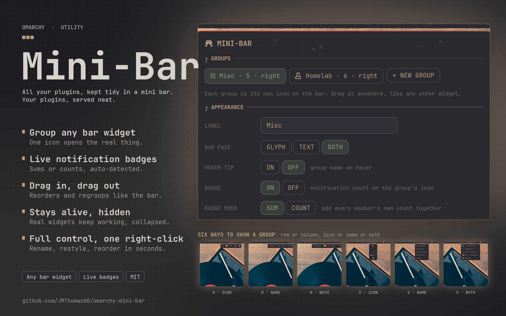
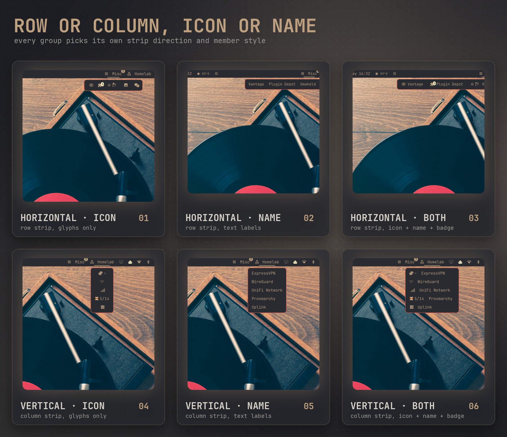

# Mini-Bar

**Collapse a cluttered Omarchy bar into one clean icon per group — for [Omarchy](https://omarchy.org).**

Right-click any widget already on your bar to fold it into a group behind one icon; left-click that icon to pop open a small strip holding the real, live widgets — not copies, not proxies. Every hosted widget keeps working exactly as it did standalone (clicks, right-clicks, scroll, hover, its own popups), and its own settings move with it, byte-for-byte, whenever you group or ungroup it. Mini-Bar itself has no settings store of its own beyond your bar's own layout config — nothing hidden left behind if you remove it.



<p align="center">
  
</p>

## What you get
- **Group any bar widget** — pick anything currently on your bar and fold it into a group; one icon replaces however many you chose.
- **Live notification badges** — a group's own icon sums (or counts) whatever notification-style property each member exposes, auto-detected, with a manual override for the rare plugin that doesn't match anything on the list.
- **Members stay alive, hidden** — a collapsed member keeps polling and updating exactly as it would on the bar; the badge above only works because of this.
- **Drag in, drag out** — reorder inside a group, or drag a member straight out of an open strip to send it back to the bar.
- **Full control from one right-click** — rename, re-glyph, switch icon/name/both, row or column, badge sum-vs-count, all staged behind a single Apply so nothing writes until you're done.

## Install
```bash
omarchy plugin add https://github.com/JMThomas00/omarchy-mini-bar.git --enable
```
Requires `jq`, which ships with Omarchy. No other dependencies.

## Update and uninstall
```bash
omarchy plugin update jmthomas00.minibar
omarchy plugin remove jmthomas00.minibar
```
Mini-Bar keeps one tiny, transient file under `~/.local/state/minibar/` — which panel was open, so it can reopen itself after a settings change triggers a reload. It's created and deleted automatically as you use the manager; there's normally nothing there to clean up by hand (`rm -rf ~/.local/state/minibar` if you ever want to be sure).

Your actual groups — which widgets are in which group, and their appearance settings — live in your own bar layout config, the same place every other bar widget's settings live; Mini-Bar doesn't keep a separate copy anywhere. **Before removing the plugin**, open each group's manager and return its members to the bar (or dissolve the group). Otherwise those widgets stay folded into a group entry the shell can no longer render once Mini-Bar is gone, and you'll want to unpick that by hand in your config afterward.

## Usage
- **Left-click** a group's icon to open or close its strip.
- **Right-click** a group's icon to open its manager: rename, restyle, reorder, add or remove members, dissolve.
- Drag a member inside an open strip, or inside the manager's own member list, to reorder it.
- Drag a member out of an open strip and release outside it to unassign it back to the bar, right where it was.
- `qs ipc call minibar.<gid> toggle` opens or closes a specific group from outside the UI — handy for a keybind. `manage` opens its manager; `close` closes both.

## Six ways to show a group
Every group picks its own strip direction (row or column) and member style (icon only, name only, or both) independently of every other group.



## Compatibility — plugins that don't play well hosted

Some third-party bar widgets resolve their own background service with a call like `bar.shell.serviceFor(<their own id>)`, expecting to always be *their own* plugin talking to *itself*. The Omarchy shell only allows that lookup to succeed when the caller genuinely is that plugin — routed through Mini-Bar's own facade instead, the check fails and the call returns nothing. The widget doesn't crash; it just falls back to its own first-run/default state while it's hosted (no live status, no saved sign-in, whatever it normally remembers), even though its **real settings stay completely intact and untouched** in your config the entire time. Un-grouping it restores it immediately — nothing was ever lost, only hidden while grouped.

Mini-Bar can't fix this from the outside — it's enforced by the shell's own trust boundary, and no third-party plugin can bypass it for another plugin. What it *can* do, and does automatically: before you add a widget to a group, the manager checks that plugin's own source for this exact pattern and shows an inline warning (`⚠ may lose its own live status/settings when grouped`) right on the button that would add it, so you find out before you commit, not after. This is a best-effort, pattern-based check, not a guarantee — a plugin could in principle reach the same broken state through a different code path this specific check doesn't catch, and a plugin that passes the check today could still start doing this in a future update.

A few Omarchy Marketplace plugins hit this as of this writing (confirmed, not necessarily exhaustive): **My Plugins** (loses its GitHub sign-in and counts), **Uptime Kuma** (loses its live monitor status, and its icon has also been observed not to render at all in some display modes), **OmaSpotify** and **ANSI Screensaver** (lose their live status). None of this is a bug in Mini-Bar or in those plugins specifically — it's a structural limit of hosting *any* widget outside its native bar. First-party bar widgets (Bluetooth, Audio, Clock, and the rest built into the shell) aren't affected and aren't scanned, since they don't live in the per-plugin directory convention the check looks at.

A couple of other honest limits, while on the subject:
- Multi-monitor setups haven't been extensively tested — developed and verified day to day on a single-monitor machine.
- A group with a very large member list makes the manager panel a long scroll. Nothing breaks, it just isn't a compact list past a certain size.

## Privacy
Mini-Bar itself never makes a network request and never phones home. It hosts other plugins' own widgets completely unchanged — whatever those plugins do on their own (network calls, credentials, anything else) is entirely theirs, unrelated to and unaffected by Mini-Bar.

## Security
- The compatibility check above only reads files under your own `~/.config/omarchy/plugins/<id>/` — a fixed, local, per-user path — and never fetches anything remote.
- Group and widget identifiers are validated (`^[A-Za-z0-9][A-Za-z0-9._-]*$`) before being used in any shell or jq invocation; nothing derived from user-entered text is interpolated into a shell command unvalidated.
- All user-supplied text — group labels, glyphs, the badge-property override field — renders as plain text (`Text.PlainText`), never as rich or HTML content.
- The one background helper (`bin/minibar-ops`) only ever rewrites your own bar layout config and the one small state file under `~/.local/state/minibar/`; it touches nothing else on disk.

## Development
The plugin is plain QML (Quickshell) plus one bash+jq helper script (`bin/minibar-ops`) for the handful of operations that touch the bar layout config. `omarchy plugin validate .` checks the manifest; there's no build step and no bundled dependencies.

## Licence
MIT. See `LICENSE`.
